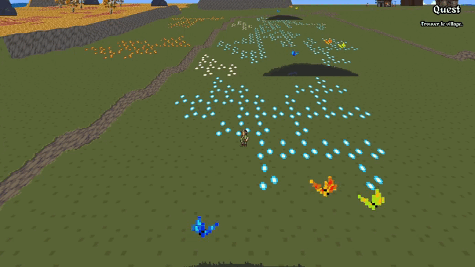

<div align="center" id="top">
  

  &#xa0;

</div>

<h1 align="center">My_rpg</h1>

<p align="center">
  <a href="#dart-about">About</a> &#xa0; | &#xa0;
  <a href="#sparkles-features">Features</a> &#xa0; | &#xa0;
  <a href="#rocket-technologies">Technologies</a> &#xa0; | &#xa0;
  <a href="#white_check_mark-requirements">Requirements</a> &#xa0; | &#xa0;
  <a href="#checkered_flag-starting">Starting</a> &#xa0; | &#xa0;
</p>

<br>

## :dart: About ##

my_rpg is EPITECH's end of the year project for every first year student at EPITECH.
It must use the CSFML library and needs some technical requirements. Other than
that, we were free to make it however we wanted, so we decided to take inspiration
from Octopath Traveler, a game made by Square Enix that has a stunning artistic direction.

<br>

:warning: This project only works under Linux and Mac for the moment! (Windows version is in progress)

## :sparkles: Features ##

:heavy_check_mark: RPG game
<br>
:heavy_check_mark: Turn by turn
<br>
:heavy_check_mark: 3D environnement
<br>
:heavy_check_mark: Progression of the character
<br>
:heavy_check_mark: It works

## :rocket: Technologies ##

The following tools were used in this project:

- [GCC](https://gcc.gnu.org/)
- [CSFML](https://www.sfml-dev.org/download/csfml/index-fr.php)
- [Visual Studio Code](https://code.visualstudio.com/)
- [Valgrind](https://valgrind.org/)

## :white_check_mark: Requirements ##

Before starting :checkered_flag:, you need to have: <br>
[Git](https://git-scm.com) <br>
[GCC](https://gcc.gnu.org/) <br>
and [CSFML](https://www.sfml-dev.org/download/csfml/index-fr.php) installed.

## :checkered_flag: Starting ##

```bash
# Clone this project
$ git clone https://github.com/Sinan-Karakaya/my_rpg

# Access
$ cd my_rpg

# Build
$ make

# Run the project
$ ./my_rpg
```

Made with :heart: by <a href="https://github.com/Sinan-Karakaya" target="_blank">Sinan Karakaya</a>
<br>
Made with :heart: by <a href="https://github.com/RoheeAxel" target="_blank">Axel Rohee</a>
<br>
Made with :heart: by <a href="https://github.com/thomasjuin1" target="_blank">Thomas Juin</a>

&#xa0;

<a href="#top">Back to top</a>
